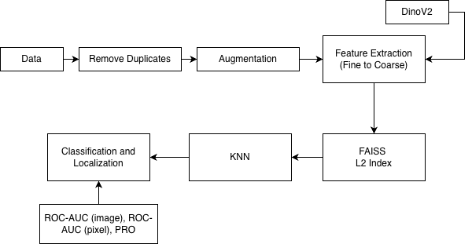
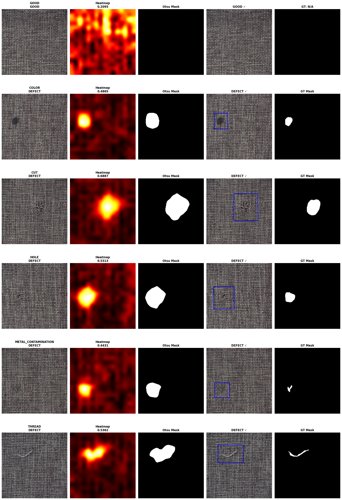
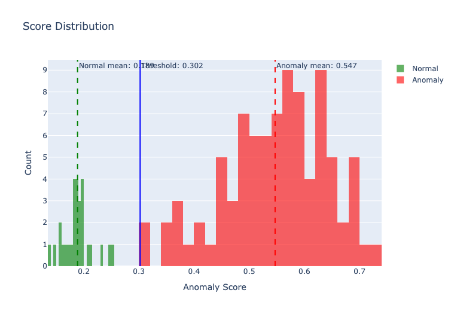
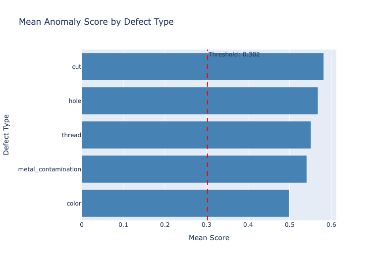
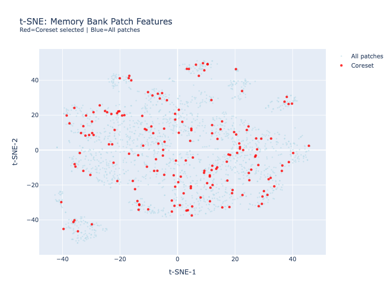

## Setup

**1. Ensure Python version:**
```
Python 3.14.3
```

**2. Create and activate virtual environment:**
```bash
python3 -m venv venv
source venv/bin/activate  # On Mac 
```

**3. Install dependencies:**
```bash
pip install -r requirements.txt
```

**4. Prepare dataset:**
Create a `dataset` folder in the root directory and download `carpet.tar.xz` from [here](https://drive.google.com/file/d/1e0BF8gSs6zflzH2tBUN6vW40UjYv_a8N/view). Extract it into the `dataset` folder.

**5. Verify folder structure:**
After step 4, the project structure should look like:
```
mvtec_carpet_anomaly/
├── dataset/
│   └── carpet.tar.xz
├── notebook.ipynb
├── requirements.txt
├── README.md
├── config.py
└── venv/
```

**6. Run notebook:**
Open `notebook.ipynb` and run all cells. Runtime:
- **CPU:** ~3-4 minutes
- **GPU:** ~2 minutes

## My Approach

This is an unsupervised anomaly detection problem. There is essentially one "good" class to model. The dataset contains 89 defective images (1K resolution). With such a small number of anomalous samples, there is a clear risk of overfitting if a supervised approach is used. However, in real industrial environments anomalies are typically rare, so having 89 defective samples in a controlled dataset is not unreasonable.

My plan was to first determine whether an image is anomalous or not, and then generate a heatmap to localize the anomaly. Ground truth masks are provided for the test set, which allows evaluation at the end of the pipeline. However, these masks cannot be used during training. Therefore, for localization I needed to customize a thresholding strategy to generate masks from anomaly scores, which I will explain later in this document.

There are two primary ways to approach anomaly detection in this context:

1. Feature-Embedding-Based Methods
2. Reconstruction-Based Methods

I chose to build most components **from scratch** instead of relying on pre-built frameworks such as *anomalib*. This gave me full control over the pipeline and allowed me to experiment and iterate quickly. My initial goal was to achieve reasonable performance using traditional methods. If that was insufficient, I planned to move toward approaches inspired by more recent research papers.


## Architecture

<div align="center">



**Figure 1:** The complete pipeline showing data flow from training images through feature extraction, FAISS indexing, KNN classification, and final localization.

</div>

The pipeline starts with the normal ("good") training images. I experimented with several augmentation strategies. However, since the images were captured from a very consistent angle and under controlled conditions, augmentations did not improve performance and in some cases even degraded it.

This observation is consistent with findings reported in [Revisiting Reverse Distillation for Anomaly Detection](https://arxiv.org/pdf/2304.03294).

The authors said that *combining multiple augmentation methods does not necessarily improve anomaly detection accuracy*.

I experimented with different feature extraction approaches, including both transformer-based and traditional CNN-based methods. Ultimately, DINOv2 provided the most stable and effective features. I also tested DINOv3, but it did not improve performance and required significantly more computation time.

Additionally, I experimented with multi-scale feature extraction instead of using only fixed 224×224 inputs, which improved the ROC-AUC score.

For vector indexing, I evaluated several FAISS-based indices such as HNSW and IVF. In my experiments, L2-based indexing performed faster and more reliably. I also briefly evaluated ScaNN that didn't work out.

Anomaly scoring is performed using k-nearest neighbors (kNN) in the feature embedding space (following PatchCore's concept).

Evaluation is conducted using:

- ROC-AUC (image-level)
- ROC-AUC (pixel-level)
- ROC-PRO


## Other Methods I Explored

### Feature Extraction & Indexing

- Cosine and Euclidean distance metrics
- Neighbor size optimization
- Duplicate detection in training data
- Data augmentation techniques

### Feature Extractors

- DINOv2
- Qwen feature extractor
- ResNet feature extractor
- Coarse-to-fine feature extraction strategies

### Vector Indexing

- Different FAISS indices
- Full memory bank vs. coreset sampling
- kNN-based anomaly detection

### Evaluation Metrics

- ROC-AUC (image-level)
- ROC-AUC (pixel-level)
- ROC-PRO
- Otsu thresholding for mask generation and bounding boxes

### Reconstruction-Based Methods

- DDPM (Denoising Diffusion Probabilistic Models)
- RD4AD
- U-Net
- DINOv2 autoencoder


### Results

The bottom method (with bold texts) is quite accurate when I tested it on the test set. I also tried some lightweight diffusion and VAE-based models, where their AUROC scores are not very strong. I believe the results could improve if I experiment with more SoTA reconstruction-based models. For the "carpet" dataset, however, my current approach works well. In my random tests on the test set, the classification of whether an image is "good" or "defective" was always to the point.

| Method | Pixel ROC-AUC | AU-PRO | Image AUROC | FPS |
|--------|---------------|--------|-------------|-----|
| ResNet Feature Extraction | 0.9339 | 0.6720 | 0.9446 | 3.35 |
| DDPM Diffusion | – | – | 0.5313 | – |
| RD4AD | – | – | 0.5173 | – |
| U-Net Reconstruction | – | – | 0.5269 | – |
| DINOv2 AutoEncoder | – | – | 0.8431 | – |
| Cosine + Flip Augmentation | 0.9914 | 0.9339 | 1.0000 | 6.82 |
| **Coarse-to-Fine + FAISS + kNN** | **0.9915** | **0.9337** | **1.0000** | **~6.5** |


For anomaly localization, I ultimately used Otsu’s Thresholding method to convert the anomaly heatmap into binary masks (Figure 2). After experimenting with several thresholding strategies, this method proved to be the most reliable and consistent with the ROC-AUC results. I do, however, think that localization could be improved more. Right now, it can say the region, but can’t capture the curves properly.

<div align="center">



**Figure 2:** Sample results showing input images, anomaly heatmaps, and generated binary masks using Otsu thresholding.

</div>

"Good" images consistently produce lower anomaly scores than defective ones, which allows me to set an optimized threshold based on roc curve that reliably distinguishes them (Figure 3).

<div align="center">



**Figure 3:** Distribution of anomaly scores for normal and defective samples. The threshold (vertical line) cleanly separates the two classes.

</div>

The features are clearly more sensitive to texture changes, which is why defects like "cut" and "hole" produce higher anomaly scores (Figure 4). In contrast, "color" defects receive lower scores because they lack strong geometric or texture disruptions.

<div align="center">



**Figure 4:** Anomaly scores broken down by defect type. Textured defects (cut, hole, thread) show higher confidence while color defects are more challenging.

</div>

Right now, my code selects patches randomly. So I wanted to see how sparse the distribution is (Figure 5). The coverage looks reasonable, but since the sampling is random it could be improved. A better approach would be to retain more representative and diverse patches using methods such as greedy coreset selection. However, since the ROC-AUC score is already strong, I did not change this part much.

<div align="center">



**Figure 5:** Visualization of randomly selected patch locations on carpet images. Shows spatial coverage across training samples.

</div>

### Observations

Feature extraction with FAISS indexing and KNN actually works best, beats most other approaches I tried. It consistently delivers solid detection and localization scores without needing heavy computational resources. 

The carpet dataset is pretty small and not super diverse. E.g., there aren't many 45-degree rotated images or extreme variations e.g. linear transoform or non-linear warping, which means there's a natural ceiling on how well any model can generalize. It's a limitation of the data itself, not necessarily the approach. 

I noticed the model's pretty confident on textured defects but struggles with color-based anomalies, which is quite obvious. Textured surfaces give it way more clues to work with. Pure color shifts are tougher to catch since they don't have that structural information. 

Multi-scale features hit better results than single-scale extraction. Makes sense since I can catch defects at different levels—some show up at a coarse scale, others need fine details. Mixing both scales gives more robust detections.


Test Time Augmentation (TTA) can make inference more robust, but in my experiments it did not improve performance much. As mentioned earlier, augmentation usually helps when images are captured under uncertain conditions. However, this dataset appears to be collected in a controlled environment with consistent cropping and viewpoint. TTA would likely be more useful if the images were taken from varying angles or conditions. In this case, especially for carpet data, geometric augmentations mostly introduced noise rather than meaningful variation.


## Limitations

The dataset could benefit from more diversity, especially images captured from different angles, to better evaluate how robust the model is. At the moment, my approach is not heavily optimized. If I explored reconstruction-based methods such as Stable Diffusion or encoder–decoder architectures, I could apply SIMD-based optimizations like batching and broadcasting, reducing duplicate calls to improve efficiency. The current patch feature extraction pipeline could also be optimized further to improve diversity and representation. There is also a possibility of overfitting. When I tested the model on random carpet images from Google, their textures were very different, and the model often produced high anomaly scores.


## Future Direction

In this work I mainly experimented with feature encoders, but another direction would be to incorporate a context encoder similar to the one used in the RAFT paper. With access to stronger GPUs and more time, diffusion-based models such as Stable Diffusion or Flux, possibly combined with latent space modifications or LoRA fine-tuning, could potentially improve the results. However, these approaches require significantly more computational resources and careful implementation based on research papers, along with substantial trial and error.

I would also prefer to implement the pipeline as standalone scripts instead of relying entirely on notebooks. Scripts tend to be more modular, easier to reason about, and simpler to integrate with code from other research papers.

### Note

My device does not have a CUDA-enabled GPU, so I had to rely on Kaggle’s GPU environment. Because of this limitation, most of the experiments were conducted in a notebook rather than through standalone scripts.

Here is the presentation [presentation](assets/mvtec.pptx) file.

I put some of my draft codes on these models under "assets" folder.

